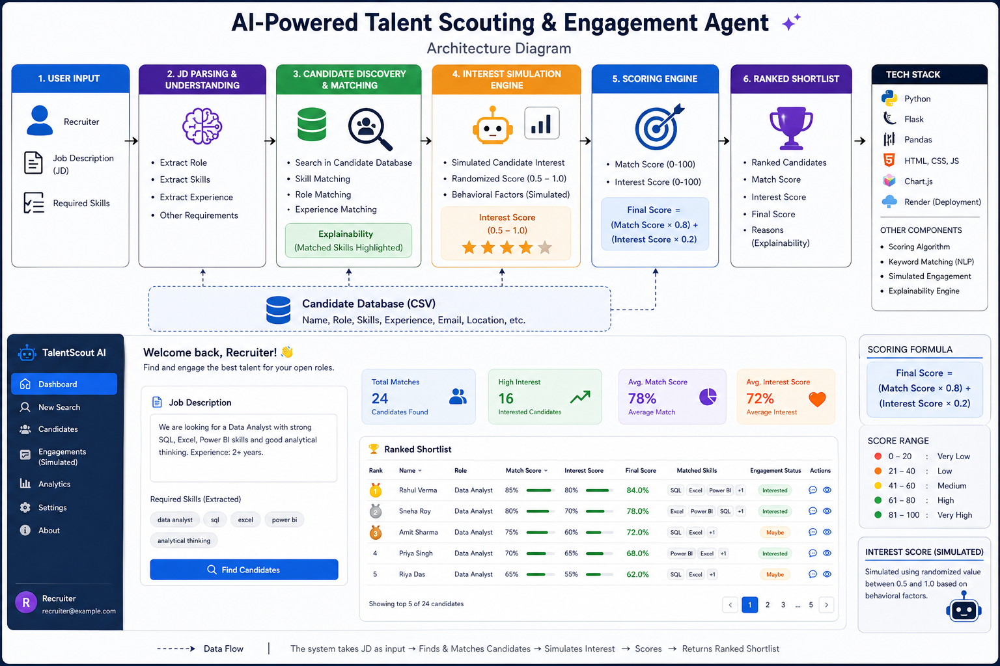

# 🤖 AI Talent Scouting Agent

## 🚀 Project Overview

The **AI Talent Scouting Agent** is an intelligent recruitment assistant that automates candidate screening and matching.

Recruiters often spend hours reviewing resumes manually. This project simplifies the process by taking a **Job Description (JD)** as input and returning a **ranked shortlist of candidates** based on:

* 🎯 **Match Score** (skill relevance)
* 💡 **Interest Score** (simulated engagement)
* 🏆 **Final Score** (combined ranking)

---

## 🔗 Live Demo

👉 https://ai-talent-agent.onrender.com

---

## 💡 Key Features

* 📄 Input Job Description (JD)
* 🧠 Automatic role detection (Data Analyst, Backend, etc.)
* 🤖 Skill-based candidate matching
* 📊 Match Score + Interest Score calculation
* 🏆 Ranked candidate shortlist
* 💬 Explainable output (matched skills shown)
* 🌐 Clean web interface using Flask

---

## 🧠 How It Works

1. User enters a Job Description
2. System detects the target role
3. Filters candidates based on role
4. Matches candidate skills with JD keywords
5. Calculates:

   * **Match Score** = matched skills / total skills
   * **Interest Score** = simulated (0.5 – 1.0)
6. Computes:

   * **Final Score = (Match × 0.8) + (Interest × 0.2)**
7. Filters candidates with **Final Score ≥ 0.60**
8. Displays ranked results

---

## 🏗️ Architecture Diagram



---

## 🛠️ Tech Stack

* **Python**
* **Flask**
* **Pandas**
* **HTML, CSS**

---

## 📂 Project Structure

```
AI_Talent_Agent/
│
├── app.py
├── utils.py
├── requirements.txt
│
├── templates/
│   └── index.html
│
├── static/
│   └── style.css
│
├── data/
│   └── candidates.csv
│
└── README.md
```

---

## 📊 Sample Input

```
Seeking a Data Analyst skilled in SQL, Excel, and Power BI
```

---

## 📊 Sample Output

| Rank | Name        | Role         | Final Score |
| ---- | ----------- | ------------ | ----------- |
| 1    | Rahul Verma | Data Analyst | 0.67        |
| 2    | Sneha Roy   | Data Analyst | 0.66        |

---

## ▶️ How to Run Locally

### 1. Install dependencies

```
pip install -r requirements.txt
```

### 2. Run the application

```
python app.py
```

### 3. Open in browser

```
http://127.0.0.1:10000
```

---

## 🎯 Use Case

This project is useful for:

* 👨‍💼 Recruiters
* 🏢 HR Teams
* 📊 Hiring Managers

to quickly shortlist candidates based on job requirements.

---

## 🔮 Future Improvements

* Resume parsing (PDF/DOCX)
* AI-based candidate interest detection
* LinkedIn / GitHub integration
* Machine Learning-based scoring model

---

## 🎥 Demo Video

(Add your video link here after recording)

---

## 👨‍💻 Author

**Suman Samanta**
